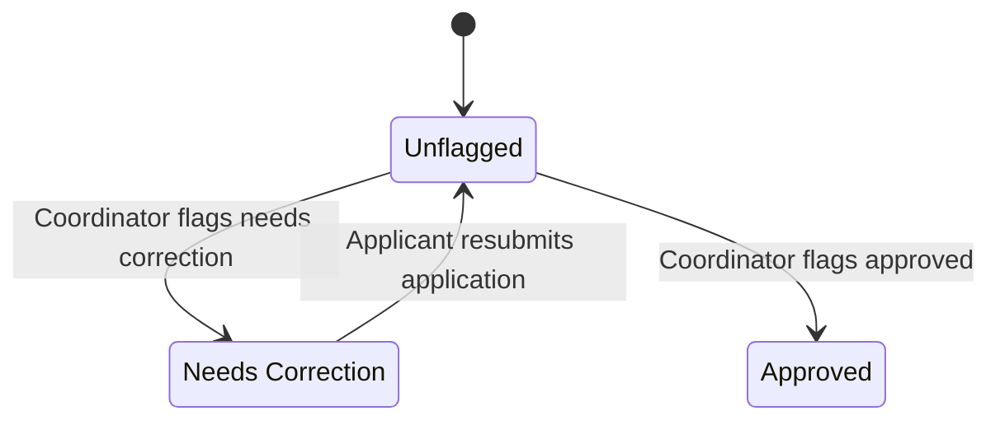
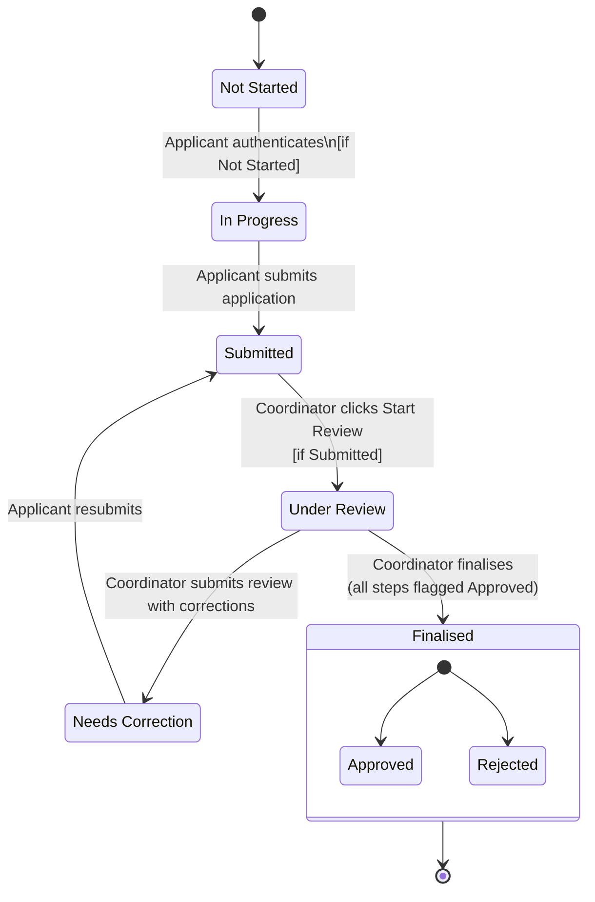

| « Prev | [🏠︎](../README.md) | [Next](./2-data-model.md) » |
| --- | --- | --- |

---

# 🔄 Workflow Architecture

 

## 1. Overview

The workflow architecture defines the internal logic of the visa-preparation system. It describes how workflows are structured, how applications are instantiated, how applicants and coordinators interact, and how progress is tracked both internally and with external authorities.

The goals of this architecture are:

* Provide a clear, linear sequence of steps for applicants
* Give coordinators a structured review and tracking system
* Support universal workflows with visa-specific variations
* Maintain simplicity, predictability, and low cognitive load
* Ensure every step has clear requirements and outcomes

---

## 2. Core Entities

These entities form the backbone of the system. They separate workflow definitions from application instances and roles from data, ensuring scalability and clarity.

In this system, attributes represent the data or state an entity holds, while behaviours represent the actions or responsibilities the entity performs based on those attributes and context. Behaviours depend on attributes to function, but attributes do not strictly determine behaviours. This distinction helps clarify the roles and capabilities of each entity within the workflow.

### 2.1 User

A person who interacts with the system, either as an applicant or coordinator.

| Attribute | Description |
| --- | --- |
| user_id | Unique identifier for the user |
| name | Full name of the user |
| email | Email address for authentication and communication |
| role | User role (applicant or coordinator) |

#### Behaviours

* **authenticate:** Verify user identity
* **access workflow instances based on role:** Access workflows according to user permissions
* **perform role-specific actions:** Execute actions permitted by the user's role

### 2.2 Workflow

A form or definition of the sequence and structure of steps for visa application processing.

| Attribute | Description |
| --- | --- |
| workflow_id | Unique identifier for the workflow |
| name | Name of the workflow (e.g., "Australian Visitor Visa Subclass 600") |
| version | Version number of the workflow |
| visa_type | The visa type this workflow applies to |
| target_country | The country this workflow targets |
| steps | Ordered list of embedded WorkflowStep definitions |
| metadata | Additional metadata such as language and region |

#### Behaviours

* **instantiate:** Creates an Application from the workflow
* **validate structure:** Validates the workflow's structure and consistency
* **support versioning:** Supports multiple versions of the workflow

### 2.3 Application (Workflow Instance)

A real application created from a Workflow. This is what the applicant fills and the coordinator reviews.

| Attribute | Description |
| --- | --- |
| application_id | Unique identifier for the application instance |
| workflow_id | Reference to the workflow |
| applicant_id | Reference to the applicant user |
| coordinator_id | Reference to the coordinator user |
| title | User-friendly label for the application |
| steps | Ordered list of embedded ApplicationStep objects within this application |
| status | Current overall application status (see Application State Machine) |
| final_outcome | The outcome once finalised — `Approved` or `Rejected`. Null until status is `Finalised` |

#### Behaviours

* track progress
* store applicant data
* store documents
* create timeline events
* finalise with outcome

### 2.4 WorkflowStep

Defines the structure of a step inside a Workflow. Steps are embedded within the Workflow entity.

| Attribute | Description |
| --- | --- |
| title | Title of the step |
| description | Description of the step |
| order_index | Position of the step in the workflow sequence |
| step_input_components | Collection of StepInputComponent definitions including fields, required documents, and validation rules |

#### Behaviours

* define title, description, requirements
* define validation logic

### 2.5 ApplicationStep

A runtime occurrence of a WorkflowStep within an Application. ApplicationStep is embedded within the Application entity and stores user responses and coordinator flags.

| Attribute | Description |
| --- | --- |
| workflow_step_id | Reference to the WorkflowStep definition |
| step_answers | List of answers provided for this step instance |
| flag | Coordinator-set flag — null until marked (see Step Flags) |

#### Behaviours

* **flag as needs correction:** Coordinator marks the step as requiring changes
* **flag as approved:** Coordinator marks the step as accepted
* **clear needs correction flag:** `NEEDS_CORRECTION` flag is cleared when the applicant resubmits — `APPROVED` flags are preserved

### 2.6 Step Input Component

Defines the input elements that structure data collection within a WorkflowStep. This entity details the types of inputs, validation rules, and metadata necessary for user interaction.

The `component_id` serves as the `field_id` reference used by both `Comment` and `Document` entities to target a specific input field.

| Attribute | Description |
| --- | --- |
| component_id | Unique identifier for the input component — referenced as `field_id` in comments and documents |
| type | Type of input (e.g., text, dropdown, file upload, date) |
| label | Display label for the input |
| required | Boolean indicating if input is mandatory |
| validation_rules | Rules to validate input (e.g., regex, range) |
| conditional_logic | Logic to show/hide input based on other inputs |
| help_text | Additional guidance for the user |
| order_index | Position of the input within the step |

#### Behaviours

* validate input
* enforce required fields
* apply conditional display logic
* provide user guidance

### 2.7 Document

A file uploaded either to a specific input field within an application step, or attached to a timeline event.

| Attribute | Description |
| --- | --- |
| document_id | Unique identifier for the document |
| application_id | Reference to the owning application |
| field_id | Input field this document belongs to — null if attached to an event |
| event_id | Event this document is attached to — null if uploaded to a step field |
| file_name | Original file name |
| storage_path | Path or URL to the stored file |
| mime_type | File MIME type (e.g., `image/jpeg`, `application/pdf`) |
| author_id | Reference to the user who uploaded the file |
| created_at | Timestamp of upload |
| updated_at | Timestamp of last replacement |

#### Behaviours

* upload
* replace

### 2.8 Comment

A comment left by a coordinator or applicant on a step or a specific input field within a step.

| Attribute | Description |
| --- | --- |
| comment_id | Unique identifier for the comment |
| application_id | Reference to the owning application |
| step_instance_id | Reference to the ApplicationStep this comment belongs to |
| author_id | Reference to the user who wrote the comment |
| field_id | Optional reference to a StepInputComponent — null means step-level comment |
| content | The comment text |
| is_resolved | Whether the comment has been resolved — false by default |
| created_at | Timestamp of the comment |

#### Comment scope

| field_id | Displayed |
| --- | --- |
| null | In the Coordinator comments block at the bottom of the step |
| set | Inline under the specific input field it references |

#### Behaviours

* add comment at step level
* add comment at field level
* display inline per field when field_id is set
* resolve comment

### 2.9 Catalogue

A reusable collection or library of standardised items such as document types, visa subclasses, or input component templates that can be referenced across workflows or steps.

| Attribute | Description |
| --- | --- |
| catalogue_id | Unique identifier for the catalogue |
| name | Name of the catalogue |
| description | Description of the catalogue's purpose |
| item_type | Type of items contained (e.g., document types, visa subclasses) |
| items | List of catalogue items or references |
| version | Version number for managing updates |

#### Behaviours

* add_item
* remove_item
* update_item
* version_control
* provide_items_for_reference

### 2.10 Event

A coordinator-created timeline entry logged against an application. Events appear chronologically on the applicant's tracking timeline.

| Attribute | Description |
| --- | --- |
| event_id | Unique identifier for the event |
| application_id | Reference to the related application |
| coordinator_id | Reference to the coordinator who created the event |
| name | Title of the event (e.g., "Application lodged", "Biometrics appointment") |
| date_time | Date and time of the event — defaults to now |
| notes | Optional additional detail |

#### Behaviours

* create event
* attach files
* display on tracking timeline

---

## 3. Workflow Model

The Workflow Model defines the conceptual and structural framework that governs how workflows are created, managed, and executed within the visa-preparation system.

### 3.1 Purpose

* Establish a clear schema for workflow templates and instances
* Define how steps are sequenced and interrelated
* Ensure consistency, adaptability, and scalability

### 3.2 Key Terms

| Term | Description |
| --- | --- |
| Workflow | A reusable template defining the structure and sequence of steps |
| WorkflowStep | A step definition embedded within a Workflow |
| StepInputComponent | An input field definition within a WorkflowStep |
| Application | A runtime instance of a Workflow created for a specific applicant |
| ApplicationStep | A runtime occurrence of a WorkflowStep within an Application |
| Transition | The movement from one state to another based on an event |
| Condition | Logical expressions that determine workflow branching or step activation |

### 3.3 Structure

The Workflow Model is composed of interconnected components:

* **Workflow:** Defines the ordered sequence of WorkflowSteps, including metadata and versioning
* **WorkflowSteps:** Each step contains StepInputComponents and validation rules
* **StepInputComponents:** Define the fields, documents, and validation for each step
* **Transitions:** Define how and when the workflow moves from one step to the next
* **Conditions:** Control branching logic and dynamic workflow paths
* **Applications:** Instances of a Workflow with runtime data and statuses

### 3.4 Versioning and Lifecycle

Workflows support versioning to allow updates and improvements without disrupting active applications. Each version maintains backward compatibility and clear migration paths. Existing applications always continue using the workflow version they were created from.

### 3.5 Integration Points

The Workflow Model includes hooks for integration with external authorities, document management systems, and notification services to ensure seamless end-to-end processing.

---

## 4. Step Anatomy

The Step Anatomy section details the internal structure and components of a WorkflowStep.

### 4.1 Purpose

* Define the detailed structure of a step
* Specify input components and their configurations
* Establish validation and conditional logic within the step
* Support user interaction and data collection

### 4.2 Components

| Component | Description |
| --- | --- |
| Title | The display title of the step |
| Description | A detailed explanation or instructions for the step |
| Input Components | Fields, questions, or document requirements that collect data |
| Validation Rules | Rules that enforce data integrity and completeness |
| Conditional Logic | Logic to show or hide inputs based on user responses |
| Help Text | Additional guidance to assist the user |

### 4.3 Input Components

StepInputComponents are the building blocks of a step, defining the data to be collected. They include various types such as text fields, dropdowns, date pickers, file uploads, and more.

| Attribute | Description |
| --- | --- |
| component_id | Unique identifier — referenced as `FieldId` in comments |
| type | Type of input (e.g., text, dropdown, file upload) |
| label | Display label for the input |
| required | Boolean indicating if the input is mandatory |
| validation_rules | Rules to validate the input (e.g., regex, range) |
| conditional_logic | Logic to show or hide the input based on other inputs |
| help_text | Additional guidance for the user |
| order_index | Position of the input within the step |

### 4.4 Validation and Conditional Logic

Validation rules ensure data correctness and completeness, while conditional logic dynamically adjusts the step based on user inputs.

### 4.5 Behaviours

* Validate inputs according to rules
* Enforce required fields
* Apply conditional display logic
* Provide user guidance and help

---

## 5. State Machines

VisaFlow uses a single application-level state machine. Steps do not have their own state machine — they have a coordinator-set flag instead.

### 5.1 Step Flags

Steps do not progress through states. Instead, each step has an optional flag set by the coordinator during review.

| Flag | Description |
| --- | --- |
| — | No flag — step has not yet been reviewed |
| Needs Correction | Coordinator has requested changes to this step |
| Approved | Coordinator has accepted this step |

Flags are:

* Set by the coordinator during review
* Visible to the applicant only when set
* Inputs are read-only when flagged Approved
* `NEEDS_CORRECTION` flag is cleared when the applicant resubmits — `APPROVED` flags are preserved

### 5.2 Application State Machine

Controls the lifecycle of the overall Application.

#### States

| State | Description |
| --- | --- |
| Not Started | Application has not been opened by the applicant |
| In Progress | Applicant is actively filling the application |
| Submitted | Applicant has submitted the whole application for review |
| Under Review | Coordinator is actively reviewing the application |
| Needs Correction | Coordinator has returned the application with any step flag set to "Needs Correction" |
| Finalised | Coordinator has made a final decision |

#### Final Outcome

When an application is `Finalised`, a separate `final_outcome` field records the result:

| Outcome | Description |
| --- | --- |
| Approved | Application accepted internally, proceeds to external tracking |
| Rejected | Application rejected, no further action |

#### Transitions

| From | To | Trigger | Actor |
| --- | --- | --- | --- |
| Not Started | In Progress | Successful authentication | Applicant |
| In Progress | Submitted | Applicant submits the whole application | Applicant |
| Submitted | Under Review | Coordinator clicks Start Review | Coordinator |
| Under Review | Needs Correction | Coordinator submits review with steps flagged Needs Correction | Coordinator |
| Under Review | Finalised | Coordinator finalises with all steps flagged Approved | Coordinator |
| Needs Correction | Submitted | Applicant resubmits the application | Applicant |

#### Diagram

### 5.3 Status-Guarded Transitions

Key transitions are guarded by the current application status to prevent re-triggering on repeat access.

| Trigger | Guard | Transition |
| --- | --- | --- |
| Applicant authenticates | status == Not Started | Not Started → In Progress |
| Coordinator clicks Start Review | status == Submitted | Submitted → Under Review |

If the guard condition is false, no transition fires. This also drives the coordinator's button label — `Start Review` when status is `Submitted`, `Resume Review` when already `Under Review`.

### 5.4 Rules and Conditions

* An application cannot be submitted unless all required step inputs and documents are complete
* An application cannot be Finalised unless all steps are flagged Approved
* Once Finalised, no further state changes are permitted
* `NEEDS_CORRECTION` step flags are cleared when the applicant resubmits — `APPROVED` flags are preserved

### 5.5 Behaviours

* Enforce state transition rules
* Trigger notifications on state changes
* Log state changes for audit and tracking
* Support manual overrides by coordinators

---

## 6. Coordinator–Applicant Interaction Loop

The system is built around a predictable, structured loop between applicants and coordinators at the application level.

### 6.1 Applicant Submission Cycle

1. Applicant authenticates → application transitions to In Progress (if Not Started)
2. Applicant navigates through steps using Continue
3. Applicant reviews all steps at the review page
4. Applicant submits the whole application → status becomes Submitted

### 6.2 Coordinator Review Cycle

1. Coordinator clicks Start Review → application transitions to Under Review (if Submitted)
2. Coordinator reviews each step, setting flags per step:
   * **Approved** — step is accepted
   * **Needs Correction** — step requires changes, with inline comments per field
3. Coordinator submits review:
   * Any steps flagged Needs Correction → application becomes Needs Correction
   * All steps flagged Approved → coordinator can Finalise the application

### 6.3 Correction Cycle

1. Applicant sees step flags and inline comments per field
2. Applicant updates flagged steps
3. Applicant resubmits the whole application → status returns to Submitted, `NEEDS_CORRECTION` flags are cleared, `APPROVED` flags are preserved

This loop continues until all steps are flagged Approved.

### 6.4 Application Finalisation Cycle

Once all steps are Approved:

1. Coordinator reviews the full application
2. Coordinator **Finalises** the application with an outcome — `Approved` or `Rejected`
3. If Approved — Event tracking begins and the applicant can track migration progress via the timeline
4. If Rejected — application enters a terminal state, remains viewable by the applicant

### 6.5 External Tracking Cycle

After finalisation with an Approved outcome:

1. Coordinator creates Events via the calendar as the application moves through the migration process
2. Events appear on the applicant's tracking timeline in chronological order
3. Each event has a name, date/time, optional notes, and optional attachments

---

## 7. Edge Cases

The system must gracefully handle irregular or unexpected situations.

### 7.1 Missing or Incorrect Documents

* Applicant uploads wrong file → coordinator marks step as Needs Correction
* Applicant forgets a file → application cannot be submitted until the required document is uploaded
* Coordinator can optionally upload a document on behalf of the applicant

### 7.2 Step Skipping or Conditional Steps

Some steps may be optional or conditional.

* Workflow defines conditions (e.g., "Only required if applicant has previous travel")
* Conditional steps appear or disappear dynamically based on applicant responses

### 7.3 Workflow Versioning

If a workflow is updated:

* Existing applications continue using their original version
* New applications use the new version
* No migration of in-progress applications between versions

### 7.4 External Authority Delays or Changes

* Coordinator can create new Events at any time
* Applicant sees a chronological timeline of updates
* If authority requests additional documents, a new temporary step can be injected

### 7.5 Applicant or Coordinator Reassignment

* Coordinator may change mid-process
* Applicant may need help from another family member
* Reassignment updates the application metadata but preserves history

### 7.6 Application Withdrawal or Cancellation

* Applicant may withdraw before submission
* Coordinator may cancel due to ineligibility
* Application enters a terminal `Withdrawn` or `Cancelled` state — distinct from `Finalised`
* Withdrawn/cancelled applications remain viewable but cannot be reactivated

---

| « Prev | [🏠︎](../README.md) | [Next](./2-data-model.md) » |
| --- | --- | --- |