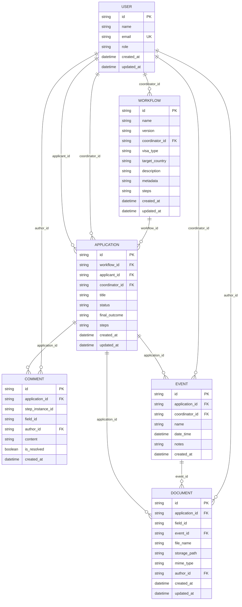

| « [Prev](./1-workflow-architecture.md) | [🏠︎](../README.md) | [Next](./3-api-design.md) » |
| --- | --- | --- |

---

# 🗂️ Data Model

 

## 1. Purpose

Based on the `problem-discovery` documents and [workflow architecture](./1-workflow-architecture.md) design, here's a proposed data model for your `VisaFlow` personal project, designed to be practical and aligned with common standards while remaining lightweight:

### 1. Core Entities

1.  User
2.  Workflow
3.  Application
4.  WorkflowStep (for reusable step definitions)
5.  ApplicationStep (instance of a step for a specific application)
6.  Document
7.  Comment
8.  Event

---

### 2. Data Model Details

#### 2.1. User
Represents both applicants and coordinators. Roles will differentiate their permissions and views.

| Attribute | Type    | Description                                             | Notes                            |
| :-------- | :------ | :------------------------------------------------------ | :------------------------------- |
| `id`      | UUID/INT | Unique identifier for the user                         | Primary Key                      |
| `name`    | String  | Full name of the user                                   |                                  |
| `email`   | String  | Email address (for magic link/access code, communication) | Unique, Not Null                 |
| `role`    | Enum    | `APPLICANT`, `COORDINATOR`                            |                                  |
| `created_at` | DateTime | Timestamp of user creation                             | Auto-generated                   |
| `updated_at` | DateTime | Last update timestamp                                   | Auto-generated                   |

#### 2.2 Application
Represents a single visa application process owned by an applicant and instantiated from a workflow.

| Attribute       | Type       | Description                                                 | Notes                          |
| :-------------- | :--------- | :---------------------------------------------------------- | :----------------------------- |
| `id`            | UUID/INT   | Unique identifier for the application                       | Primary Key                    |
| `workflow_id`   | UUID/INT   | Foreign Key to `Workflow`                                   |                                |
| `applicant_id`  | UUID/INT   | Foreign Key to `User` (role = APPLICANT)                    |                                |
| `coordinator_id`| UUID/INT   | Foreign Key to `User` (role = COORDINATOR)                  |                                |
| `steps`         | JSON       | Array of embedded `ApplicationStep` objects                  | Stores step responses, flags, and coordinator notes |
| `status`        | Enum       | `NOT_STARTED`, `IN_PROGRESS`, `SUBMITTED`, `UNDER_REVIEW`, `NEEDS_CORRECTION`, `FINALISED` | Overall application status     |
| `final_outcome` | Enum       | `APPROVED`, `REJECTED`                                      | Null until status is `FINALISED` |
| `title`         | String     | A user-friendly title for the application (e.g., "Aunty's Visitor Visa") |                                |
| `created_at`    | DateTime   | Timestamp of application creation                           | Auto-generated                 |
| `updated_at`    | DateTime   | Last update timestamp                                       | Auto-generated                 |

#### 2.3. Workflow
Defines a workflow form used to create applications.

| Attribute    | Type       | Description                                                 | Notes                          |
| :----------- | :--------- | :---------------------------------------------------------- | :----------------------------- |
| `id`         | UUID/INT   | Unique identifier for the workflow                  | Primary Key                    |
| `name`       | String     | Name of the workflow (e.g., "Australian Visitor Visa Subclass 600") |                         |
| `version`    | String     | Version identifier for the workflow                          |                                |
| `coordinator_id` | UUID/INT | Foreign Key to `User` (role = COORDINATOR)                   | Owner/creator of the workflow |
| `visa_type`  | String     | The visa type this workflow applies to                       |                                |
| `target_country` | String | The country this workflow targets                             |                                |
| `description`| Text       | Optional description of the workflow                          |                                |
| `metadata`   | JSON       | Optional additional metadata such as language and region     |                                |
| `steps`      | JSON       | Array of embedded `WorkflowStep` objects                      | Stores step definitions and input configuration |
| `created_at` | DateTime   | Timestamp of workflow creation                               | Auto-generated                 |
| `updated_at` | DateTime   | Last update timestamp                                       | Auto-generated                 |

#### 2.4. WorkflowStep
Defines the structure and requirements for a step within a workflow. Stored as an embedded JSON object inside `Workflow.steps`.

| Attribute      | Type       | Description                                                 | Notes                                    |
| :------------- | :--------- | :---------------------------------------------------------- | :--------------------------------------- |
| `step_id`      | String     | Local identifier for the workflow step definition           | Used to reference step instances        |
| `title`        | String     | E.g., "Upload Passport Photo"                             |                                          |
| `instructions` | Text       | Detailed instructions for the step                          |                                          |
| `inputs_config`| JSON       | JSON schema for input components, validation, and catalogue references | Stores the UI input definitions for the step |
| `order`        | INT        | Display order within the workflow                    |                                          |
| `is_required`| Boolean    | Whether this step is mandatory                              | Default: `true`                          |
| `created_at` | DateTime   | Timestamp of creation                                        | Auto-generated                           |
| `updated_at` | DateTime   | Last update timestamp                                        | Auto-generated                           |

#### 2.5. ApplicationStep
An instance of a `WorkflowStep` within a specific `Application`, tracking its runtime status and user responses. Stored as an embedded JSON object inside `Application.steps`.

| Attribute        | Type       | Description                                                 | Notes                          |
| :-------------- | :--------- | :---------------------------------------------------------- | :----------------------------- |
| `instance_id`    | String     | Local identifier for the application step instance          | Used to reference step data   |
| `workflow_step_id`| String    | Identifier of the corresponding workflow step definition    | Matches `WorkflowStep.step_id`|
| `step_answers`   | JSON       | User-submitted answers or data for this step                |                                |
| `flag`          | Enum       | `NEEDS_CORRECTION`, `APPROVED`                              | Null until set by coordinator; `NEEDS_CORRECTION` cleared on resubmission, `APPROVED` preserved |

#### 2.6. Document
Represents a file uploaded either to a specific input field within an application step, or attached to a timeline event.

| Attribute         | Type       | Description                                                 | Notes                          |
| :---------------- | :--------- | :---------------------------------------------------------- | :----------------------------- |
| `id`              | UUID/INT   | Unique identifier for the document                          | Primary Key                    |
| `application_id`  | UUID/INT   | Foreign Key to `Application`                                |                                |
| `field_id`        | String     | Input field this document belongs to                        | Null if attached to an event; matches `StepInputComponent.component_id` |
| `event_id`        | UUID/INT   | Event this document is attached to                          | Null if uploaded to a step field |
| `file_name`       | String     | Original file name                                          |                                |
| `storage_path`    | String     | Path or URL to the stored file                              | Not Null                       |
| `mime_type`       | String     | E.g., `image/jpeg`, `application/pdf`                     |                                |
| `author_id`       | UUID/INT   | Foreign Key to `User` (the uploader)                        |                                |
| `created_at`      | DateTime   | Timestamp of upload                                         | Auto-generated                 |
| `updated_at`      | DateTime   | Timestamp of last replacement                               | Auto-generated                 |

#### 2.7. Comment
For coordinator feedback on specific input fields, or general notes on a step.

| Attribute         | Type       | Description                                                 | Notes                          |
| :---------------- | :--------- | :---------------------------------------------------------- | :----------------------------- |
| `id`              | UUID/INT   | Unique identifier for the comment                           | Primary Key                    |
| `step_instance_id`| String     | Identifier of the related embedded application step        | Matches `ApplicationStep.instance_id` |
| `field_id`        | String     | Identifier of the related input field                       | Null if targeting the step; matches `StepInputComponent.component_id` |
| `author_id`       | UUID/INT   | Foreign Key to `User`                                       |                                |
| `content`         | Text       | The comment text                                            | Not Null                       |
| `is_resolved`     | Boolean    | Whether the comment has been resolved                       | Default: `false`               |
| `created_at`      | DateTime   | Timestamp of comment creation                               | Auto-generated                 |

#### 2.8. Event
A coordinator-created timeline entry logged against an application. Events appear chronologically on the applicant's tracking timeline.

| Attribute       | Type       | Description                                                 | Notes                          |
| :-------------- | :--------- | :---------------------------------------------------------- | :----------------------------- |
| `id`            | UUID/INT   | Unique identifier for the event                             | Primary Key                    |
| `application_id`| UUID/INT   | Foreign Key to `Application`                                |                                |
| `coordinator_id`| UUID/INT   | Foreign Key to `User` (the coordinator who created the event) |                                |
| `name`          | String     | Title of the event (e.g., "Application lodged")             | Not Null                       |
| `date_time`     | DateTime   | Date and time of the event                                  | Defaults to now                |
| `notes`         | Text       | Optional additional detail                                  |                                |
| `created_at`    | DateTime   | Timestamp of record creation                                | Auto-generated                 |

---

### 3. Relationships

---

### 4. Relationship Summary

*   `Workflow` stores embedded step definitions in its `steps` JSON array.
*   `Workflow` is owned by one coordinator via `coordinator_id`.
*   `Application` stores embedded step instances in its `steps` JSON array.
*   `Application` is owned by one applicant and assigned to one coordinator.
*   `Document` and `Comment` remain separate entities to preserve file storage and threaded feedback.
*   `Application` can have many `Document` and `Comment` records.
*   A `Document` is linked to either a specific input field via `field_id` (step upload) or an `Event` via `event_id` (event attachment) — not both.
*   A `Comment` targets a specific input field via `field_id`, or the step as a whole when `field_id` is null.
*   `Event` records belong to one `Application`, are created by a coordinator, and may have `Document` attachments.

---

### 5. Embedded step model notes

*   `WorkflowStep` and `ApplicationStep` are represented as embedded JSON objects, not as standalone persisted tables in this model.
*   `WorkflowStep` defines rendering metadata, instructions, input configuration, and order.
*   `ApplicationStep` contains the runtime answers, coordinator flag, and coordinator notes.
*   `Document` and `Comment` are linked contextually via `application_id`; Comments also carry `step_instance_id` to target a specific step.

---

| « [Prev](./1-workflow-architecture.md) | [🏠︎](../README.md) | [Next](./3-api-design.md) » |
| --- | --- | --- |