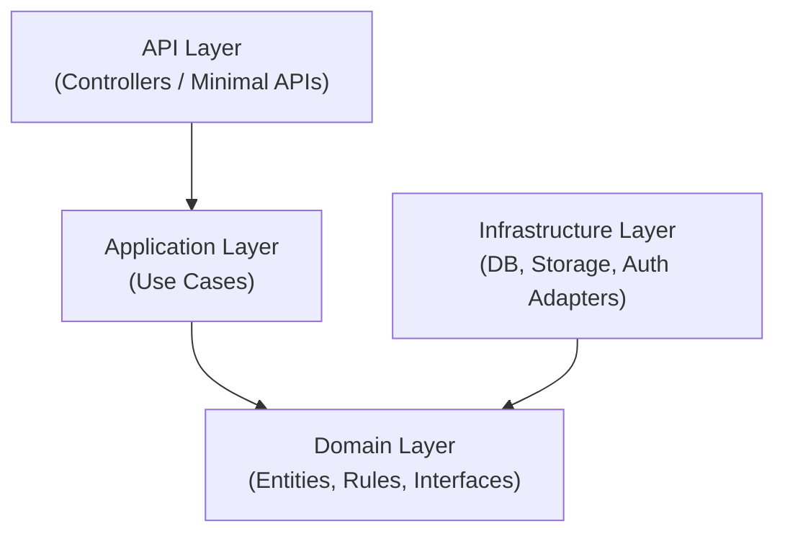
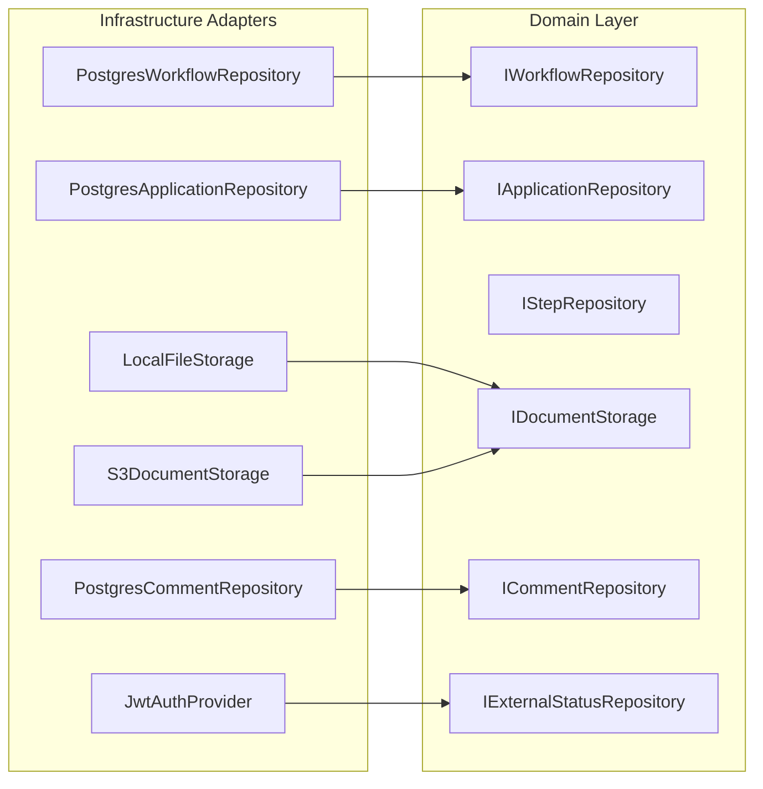
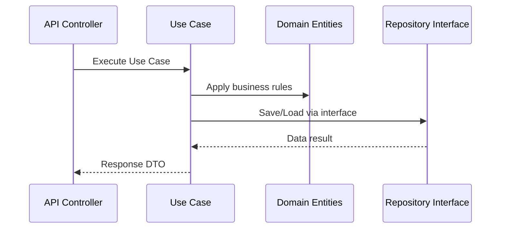
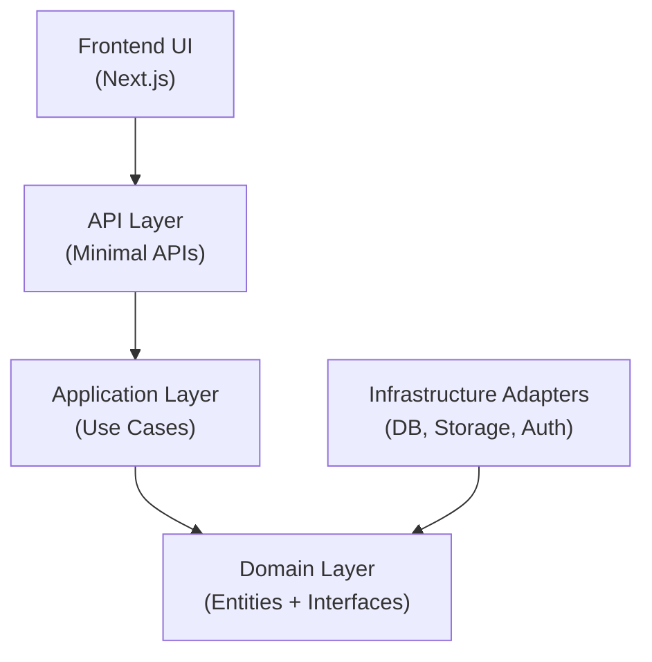

| « [Prev](./3-api-design.md) | [🏠︎](../README.md) | [Next](./5-implementation-plan.md) » |
| --- | --- | --- |

---

# 🧅 System Architecture

 

This document defines the VisaFlow system architecture using Onion Architecture, where the domain and workflow engine sit at the centre, surrounded by layers that depend inward. This approach ensures testability, maintainability, and freedom from vendor lock‑in — ideal for a personal project that may evolve over time.

---

## 1. Architecture Goals

- Keep the domain pure and independent of frameworks  
- Avoid coupling to specific databases or third‑party services  
- Make the workflow engine testable without infrastructure  
- Allow infrastructure (DB, storage, auth) to be swapped easily  
- Maintain a simple, understandable structure  
- Support the workflow, state machine, and API design defined earlier  

---

## 2. Onion Architecture Overview

VisaFlow is structured into concentric layers.  
Dependencies always point **inward** toward the domain.

### Dependency Rule

All dependencies point inward.  
Outer layers depend on inner layers — never the reverse.

---

## 3. Domain Layer (Core)

The domain layer is the heart of VisaFlow.  
It contains **no external dependencies** and represents the pure business logic.

### 3.1 Domain Entities

- `User`  
- `Workflow`  
- `WorkflowStep`  
- `Application`  
- `ApplicationStep`  
- `Document` (metadata only)  
- `Comment`  
- `ExternalStatus`  

### 3.2 Domain Rules

- Workflow structure  
- Step validation  
- State machine transitions  
- Coordinator–applicant interaction loop  

### 3.3 Domain Interfaces (Ports)

These define *what* must be done, not *how*.

---

## 4. Application Layer (Use Cases)

This layer orchestrates domain logic and coordinates interactions between domain entities and infrastructure.

### 4.1 Use Case Examples

- `CreateApplicationUseCase`  
- `SubmitStepUseCase`  
- `ApproveStepUseCase`  
- `RequestCorrectionUseCase`  
- `UploadDocumentUseCase`  
- `AddExternalStatusUpdateUseCase`  

### 4.2 Responsibilities

- Enforce workflow rules  
- Execute state transitions  
- Validate inputs  
- Call domain interfaces (repositories, storage)  
- Return DTOs to the API layer  

### 4.3 Use Case Flow Diagram

---

## 5. Infrastructure Layer (Adapters)

This is the outermost layer — everything here is replaceable.

### 5.1 Database Adapters

- `PostgresApplicationRepository`  
- `PostgresWorkflowRepository`  
- `PostgresCommentRepository`  

### 5.2 File Storage Adapters

- Local filesystem (development)  
- S3  
- Supabase Storage  

### 5.3 Auth Provider

- JWT (self‑issued)  
- Or Supabase Auth (optional)  

### 5.4 HTTP API Layer

- Minimal API endpoints  
- Maps HTTP requests to use cases  
- Serialises responses  

---

## 6. Frontend Architecture

The frontend interacts with the API layer.

### 6.1 Technology (Recommended)

- Next.js  
- Tailwind CSS  
- React Query  
- Mobile‑first  

### 6.2 Responsibilities

- Render workflow steps  
- Handle applicant submissions  
- Handle coordinator reviews  
- Display progress and external status timeline  
- Upload documents via API  

---

## 7. System Diagram (Onion‑Aligned)

---

## 8. Benefits of Onion Architecture for VisaFlow

### 8.1 Testability

Use cases and domain logic can be tested with mocks — no database required.

### 8.2 Replaceability

Swap components such as:

- Postgres → SQL Server  
- Local storage → S3  
- JWT → Supabase Auth  

…without touching domain logic.

### 8.3 Maintainability

Clear boundaries prevent code rot.

### 8.4 Scalability

You can add features like:

- AI document checks  
- Multi‑coordinator support  
- Workflow versioning  
- Automation  

…without breaking the core.

---

## 9. Summary

VisaFlow uses Onion Architecture to ensure:

- A pure, framework‑independent domain  
- A clean workflow engine and state machine  
- Replaceable infrastructure  
- Highly testable use cases  
- A thin, simple API layer  
- A flexible foundation for future growth  

This architecture is ideal for a personal project that may evolve into something larger.

---

| « [Prev](./3-api-design.md) | [🏠︎](../README.md) | [Next](./5-implementation-plan.md) » |
| --- | --- | --- |
