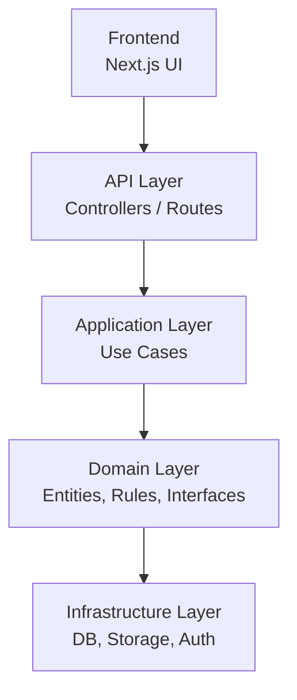
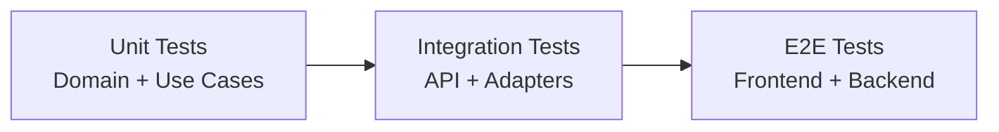

| « [Prev](./4-system-architecture.md) | [🏠︎](../README.md) | [Next](./6-tech-stack.md) » |
| --- | --- | --- |

---

# 🛠️ Implementation Plan

 

This document outlines the step‑by‑step plan for implementing VisaFlow using **Onion Architecture**.  
The goal is to build a clean, testable, maintainable MVP while keeping development lightweight and enjoyable.

---

## 1. High‑Level Roadmap

VisaFlow will be implemented in four major layers:

Development proceeds **inside‑out**, starting from the domain.

---

## 2. Phase 1 — Domain Layer

### 2.1 Define Entities
Create pure domain models with no external dependencies:

- `User`
- `Workflow`
- `WorkflowStep`
- `Application`
- `ApplicationStep`
- `Document` (metadata only)
- `Comment`
- `ExternalStatus`

### 2.2 Implement Domain Rules
- Step state machine  
- Application state machine  
- Validation rules  
- Workflow structure rules  

### 2.3 Define Domain Interfaces (Ports)
Create abstractions for infrastructure:

- `IWorkflowRepository`
- `IApplicationRepository`
- `IStepRepository`
- `IDocumentStorage`
- `ICommentRepository`
- `IExternalStatusRepository`

### 2.4 Output of this phase
- Pure domain logic  
- Zero dependencies  
- Fully testable with mocks  

---

## 3. Phase 2 — Application Layer (Use Cases)

### 3.1 Implement Core Use Cases
Each use case orchestrates domain logic + interfaces:

- `CreateApplicationUseCase`
- `SubmitStepUseCase`
- `ApproveStepUseCase`
- `RequestCorrectionUseCase`
- `UploadDocumentUseCase`
- `AddExternalStatusUpdateUseCase`

### 3.2 Use In‑Memory Repositories
Before building real infrastructure:

- `InMemoryApplicationRepository`
- `InMemoryWorkflowRepository`
- `InMemoryDocumentStorage`

This enables fast iteration and testing.

### 3.3 Add DTOs
Define input/output shapes for API layer.

### 3.4 Output of this phase
- Fully testable use cases  
- No infrastructure required  
- Domain + use cases working together  

---

## 4. Phase 3 — Infrastructure Layer (Adapters)

### 4.1 Implement Database Adapters
Start simple:

- SQLite or Postgres (local)
- OR Supabase (if preferred)

Adapters implement domain interfaces:

- `PostgresApplicationRepository`
- `PostgresWorkflowRepository`
- `PostgresCommentRepository`

### 4.2 Implement File Storage Adapter
Start with local filesystem:

- `LocalFileStorageAdapter`

Later add:

- S3  
- Supabase Storage  

### 4.3 Implement Auth Provider
Choose one:

- Supabase Auth  
- Firebase Auth  
- Custom JWT  

### 4.4 Output of this phase
- Real persistence  
- Real document storage  
- Real authentication  

---

## 5. Phase 4 — API Layer

### 5.1 Build Controllers
Map HTTP routes to use cases:

- `/applications`
- `/applications/:id/steps/:stepId/submit`
- `/documents`
- `/comments`
- `/external-status-updates`

### 5.2 Add Request Validation
Use a lightweight schema validator.

### 5.3 Add Error Handling
Return consistent error shapes.

### 5.4 Output of this phase
- Fully functional backend  
- Clean separation between API and use cases  

---

## 6. Phase 5 — Frontend (Next.js)

### 6.1 Applicant Screens
- Home (steps list)
- Step detail
- Document upload
- Correction flow
- External status timeline

### 6.2 Coordinator Screens
- Dashboard
- Application overview
- Step review
- External status updates

### 6.3 Integrate with API
- Token handling
- File uploads
- Step submission
- Review actions

### 6.4 Output of this phase
- End‑to‑end functional MVP  

---

## 7. Phase 6 — Testing Strategy

### 7.1 Unit Tests
- Domain rules  
- State machines  
- Use cases (with mocks)  

### 7.2 Integration Tests
- API endpoints  
- Repositories  
- Storage adapters  

### 7.3 End‑to‑End Tests
- Full applicant flow  
- Full coordinator flow  

---

## 8. Phase 7 — Deployment

### 8.1 Backend
- Deploy API to Render, Railway, or Supabase Functions  
- Use environment variables  
- Add migrations  

### 8.2 Frontend
- Deploy to Vercel  

### 8.3 Storage
- S3 or Supabase Storage  

### 8.4 Auth
- Supabase Auth or Firebase Auth  

---

## 9. MVP Completion Criteria

VisaFlow MVP is complete when:

- Applicants can complete all steps  
- Coordinators can review and approve  
- Documents can be uploaded  
- Comments can be exchanged  
- External status updates can be added  
- Workflow engine enforces state transitions  
- Everything works end‑to‑end  

---

## 10. Summary

This implementation plan provides a clear, structured path to building VisaFlow using Onion Architecture:

- Start with the domain  
- Build use cases  
- Add infrastructure  
- Expose via API  
- Build the frontend  
- Test thoroughly  
- Deploy simply  

This ensures a clean, maintainable, and scalable foundation for the project.

---

| « [Prev](./4-system-architecture.md) | [🏠︎](../README.md) | [Next](./6-tech-stack.md) » |
| --- | --- | --- |
