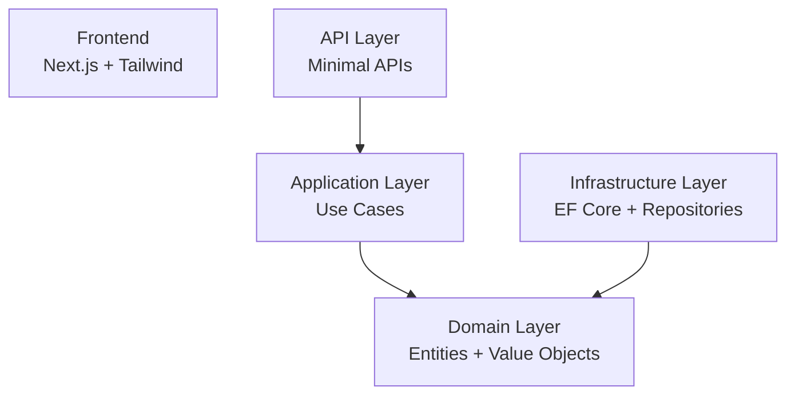

| « [Prev](./5-implementation-plan.md) | [🏠︎](../README.md) | [Next](./7-database-schema.md) » |
| --- | --- | --- |

---

# 🧰 Tech Stack


<br/>

This document defines the technology stack for VisaFlow.  
The stack prioritises **clean architecture**, **strong typing**, **long‑term maintainability**, and **free, low‑friction deployment**.

VisaFlow uses a C# backend with Onion Architecture, a Next.js frontend, and a Postgres database hosted on Render’s free tier.

---

## 1. Architecture Overview

VisaFlow follows Onion Architecture, where dependencies always point **inward** toward the domain.

<div align="center">



</div>
<br/>

This diagram represents **dependency direction**, not execution flow.

- The **Domain** is the centre of the architecture.  
- The **Application** layer depends on the Domain.  
- The **API** layer depends on the Application layer.  
- The **Infrastructure** layer depends on the Domain.  
- The **Frontend** is external and simply calls the API; it is not part of the backend dependency graph.

---

## 2. Backend Language & Runtime

### C# (.NET 8)

Chosen for:

- Strong typing  
- Excellent support for Onion Architecture  
- Clean domain modelling  
- Predictable performance  
- Great tooling (Rider / VS Code / Visual Studio)  

### Runtime

- .NET 8 LTS  
- ASP.NET Minimal APIs  

---

## 3. Domain Layer (Pure C#)

The domain layer contains **no external dependencies** and represents the pure business logic.

### Includes

- Entities  
- Value Objects  
- Domain Services (if needed)  
- State Machines (workflow engine)  
- Domain Exceptions  
- Interfaces (ports)  

### Principles

- No EF Core  
- No HTTP  
- No infrastructure concerns  
- 100% testable  
- 100% deterministic  

---

## 4. Application Layer (Use Cases)

Implements business workflows using domain rules.

### Includes

- Use case classes  
- Input/Output DTOs  
- Orchestrates domain logic  
- Depends only on domain interfaces  

### No frameworks here

- No EF Core  
- No ASP.NET  
- No external libraries  

Pure C#.

---

## 5. Infrastructure Layer

Implements domain interfaces using real services.

### Database

- Postgres (Render free tier)  
- SQL Server optional for local development  
- EF Core for ORM  
- Migrations via EF Core Tools  

### Repositories

- EF Core repository implementations  
- Maps DB models ↔ domain models  

### File Storage

Start simple:

- Local filesystem (`/uploads`)

Future options:

- S3  
- Azure Blob  
- Supabase Storage  

### Authentication

- JWT (self‑issued)  
- Or Supabase Auth (optional)  

### Email (Optional)

- Resend  
- Postmark  

---

## 6. API Layer

### ASP.NET Minimal APIs

Chosen because they are:

- Lightweight  
- Fast  
- Clean  
- Perfect for small services  
- Easy to deploy on Render  

### Validation

- FluentValidation  
- Or custom validators  

### Serialisation

- System.Text.Json  

---

## 7. Frontend Stack

### Framework

Next.js (App Router)

Reasons:

- File‑based routing  
- Server components  
- Great DX  
- Easy deployment on Vercel  

### Styling

- Tailwind CSS  

### Data Fetching

- React Query  

### File Uploads

- Native `<input type="file">`  
- Upload via API route  

---

## 8. Testing Stack

### Unit Tests

- xUnit  
- FluentAssertions  

### Integration Tests

- WebApplicationFactory  
- Testcontainers (optional)  

### End‑to‑End Tests

- Playwright (frontend)  

---

## 9. DevOps & Deployment

### Backend Deployment

Render.com (Free Tier)

- Zero DevOps  
- Zero Kubernetes  
- Zero Docker  
- Auto‑deploy on git push  
- Free Postgres instance  
- Free web service  

### Frontend Deployment

Vercel (Free Tier)

- Perfect for Next.js  
- Instant deployments  
- Custom domains  

### Database

Render Postgres (Free Tier)

- Persistent storage  
- Easy migrations  
- Built‑in dashboard  

### Environment Management

- `.env`  
- Render environment variables  
- Vercel environment variables  

---

## 10. Logging Stack

VisaFlow uses **Serilog** as the logging engine, always coded against Microsoft's `ILogger<T>` abstraction.

### Logging Abstraction

- `ILogger<T>` — Microsoft's built-in interface, used everywhere in code
- Never reference Serilog directly in Domain or Application layers

### Serilog

- Structured logging engine
- Plugs in behind `ILogger<T>`
- Configured once in `Program.cs`

### Sinks

| Sink | Environment | Purpose |
|---|---|---|
| Console | All | Terminal output |
| Seq | Development | Local log UI at `http://localhost` |
| Logtail (Better Stack) | Production | Cloud log storage and querying |

### Installation

```pwsh
dotnet add package Serilog.AspNetCore
dotnet add package Serilog.Sinks.Console
dotnet add package Serilog.Sinks.Seq
dotnet add package Serilog.Sinks.BetterStack
```

### Log Levels

| Level | When |
|---|---|
| `Debug` | Detailed dev info |
| `Information` | Normal operations, happy path |
| `Warning` | Unexpected but recoverable |
| `Error` | Something failed, needs attention |
| `Critical` | App is broken |

### Where Logging Lives

| Layer | Logging |
|---|---|
| Domain | None — pure business logic |
| Application | `ILogger<T>` injected into use cases |
| Infrastructure | `ILogger<T>` for DB and storage operations |
| API | Serilog pipeline, request logging middleware |

---

## 11. Summary

VisaFlow's tech stack is designed to be:

- Strongly typed
- Cleanly architected
- Easy to deploy for free
- Familiar (React + .NET + SQL)
- Long-term maintainable
- Aligned with enterprise patterns
- Observable via structured logging (Serilog + Seq + Logtail)

This stack gives you the best of both worlds:
**C# architecture quality + free, simple deployment.**

---

| « [Prev](./5-implementation-plan.md) | [🏠︎](../README.md) | [Next](./7-database-schema.md) » |
| --- | --- | --- |
