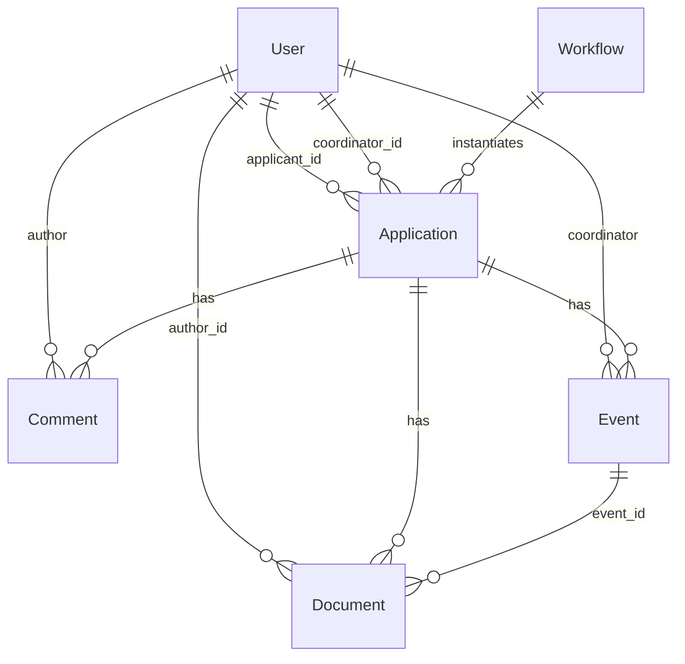

| « [Prev](./6-tech-stack.md) | [🏠︎](../README.md) | [Next](./8-folder-structure.md) » |
| --- | --- | --- |

---

# 🗄️ Database Schema

 

This document defines the relational database schema for **VisaFlow**, aligned with the **Data Model** and **Workflow Architecture**.  
It is optimised for **Postgres on Render (free tier)** and supports:

- A reusable workflow engine  
- Embedded workflow step definitions (JSONB)  
- Embedded application step instances (JSONB)  
- Strong typing  
- Minimal friction for a personal project  

The schema is intentionally **simple**, **normalised**, and **workflow‑driven**, consistent with your design principle:

> **Simplicity is the product.**

---

## 1. Entity Relationship Diagram (ERD)

---

## 2. Tables

Below are the updated tables reflecting the **Data Model** exactly.

## 2.1 `users`

Stores both applicants and coordinators.

| Column        | Type        | Notes |
|---------------|-------------|-------|
| id            | uuid (PK)   | generated by backend |
| email         | text        | unique, required |
| name          | text        | optional |
| role          | user_role   | `applicant` or `coordinator` |
| created_at    | timestamptz | default now() |
| updated_at    | timestamptz | default now() |

## 2.2 `workflows`

Defines a reusable workflow template (e.g., “Universal Skeleton”, “Subclass 600”).

| Column        | Type        | Notes |
|---------------|-------------|-------|
| id            | uuid (PK)   | |
| name          | text        | |
| version       | text        | workflow version identifier |
| coordinator_id | uuid (FK)  | references users(id) |
| visa_type     | text        | e.g., "Visitor Visa" |
| target_country | text       | e.g., "Australia" |
| description   | text        | optional |
| metadata      | jsonb       | optional (language, region, etc.) |
| steps         | jsonb       | array of embedded `WorkflowStep` objects |
| created_at    | timestamptz | |
| updated_at    | timestamptz | |

## 2.3 `applications`

Represents a single applicant’s visa application, instantiated from a workflow.

| Column        | Type        | Notes |
|---------------|-------------|-------|
| id            | uuid (PK)   | |
| workflow_id   | uuid (FK)   | references workflows(id) |
| applicant_id  | uuid (FK)   | references users(id) |
| coordinator_id | uuid (FK)  | references users(id) |
| title         | text        | user-friendly label |
| status        | application_status | `not_started`, `in_progress`, `submitted`, `under_review`, `needs_correction`, `finalised` |
| final_outcome | final_outcome | nullable — `approved` or `rejected`; set when status is `finalised` |
| steps         | jsonb       | array of embedded `ApplicationStep` objects |
| created_at    | timestamptz | |
| updated_at    | timestamptz | |

## 2.4 `documents`

Metadata for uploaded files. A document belongs to either a step field or an event attachment — not both.

| Column            | Type        | Notes |
|-------------------|-------------|-------|
| id                | uuid (PK)   | |
| application_id    | uuid (FK)   | references applications(id) |
| field_id          | text        | nullable — matches StepInputComponent.component_id |
| event_id          | uuid (FK)   | nullable — references events(id) |
| file_name         | text        | original filename |
| storage_path      | text        | S3/local path |
| mime_type         | text        | |
| author_id         | uuid (FK)   | references users(id) |
| created_at        | timestamptz | |
| updated_at        | timestamptz | set on file replacement |

## 2.5 `comments`

Comments left by coordinators or applicants on a step or a specific input field within a step.

| Column            | Type        | Notes |
|-------------------|-------------|-------|
| id                | uuid (PK)   | |
| application_id    | uuid (FK)   | references applications(id) |
| step_instance_id  | text        | matches ApplicationStep.instance_id |
| field_id          | text        | nullable — matches StepInputComponent.component_id; null means step-level comment |
| author_id         | uuid (FK)   | references users(id) |
| content           | text        | |
| is_resolved       | boolean     | default false |
| created_at        | timestamptz | |

## 2.6 `events`

Coordinator-created timeline entries logged against an application.

| Column            | Type        | Notes |
|-------------------|-------------|-------|
| id                | uuid (PK)   | |
| application_id    | uuid (FK)   | references applications(id) |
| coordinator_id    | uuid (FK)   | references users(id) |
| name              | text        | title of the event |
| date_time         | timestamptz | defaults to now() |
| notes             | text        | optional |
| created_at        | timestamptz | |

---

## 3. Enums

### `user_role`
- `applicant`
- `coordinator`

### `application_status`
- `not_started`
- `in_progress`
- `submitted`
- `under_review`
- `needs_correction`
- `finalised`

### `final_outcome`
- `approved`
- `rejected`

### `step_flag`
- `needs_correction`
- `approved`

---

## 4. Indexing Strategy

Recommended indexes:

- `users.email` (unique)
- `workflows.coordinator_id`
- `applications.applicant_id`
- `applications.workflow_id`
- `documents.application_id`
- `documents.field_id`
- `documents.event_id`
- `comments.application_id`
- `comments.step_instance_id`
- `events.application_id`

These support the most common queries in the workflow engine.

---

## 5. Mapping to Domain Layer

This schema maps cleanly to your **Onion Architecture**:

- **Domain Entities** → tables  
- **Value Objects** → JSONB fields (steps, metadata)  
- **Repositories** → EF Core implementations  
- **Use Cases** → orchestrate reads/writes  
- **API Layer** → DTOs  

No infrastructure concerns leak into the domain.

---

## 6. Summary

This updated schema:

- Fully matches the **Data Model**  
- Uses **embedded JSONB** for workflow and application steps  
- Removes unnecessary tables  
- Supports your workflow engine  
- Is simple enough for a personal project  
- Is flexible for future growth  
- Works perfectly on **Render Postgres free tier**  

You can now safely generate your **EF Core migrations** and begin implementing repositories.

---

| « [Prev](./6-tech-stack.md) | [🏠︎](../README.md) | [Next](./8-folder-structure.md) » |
| --- | --- | --- |
